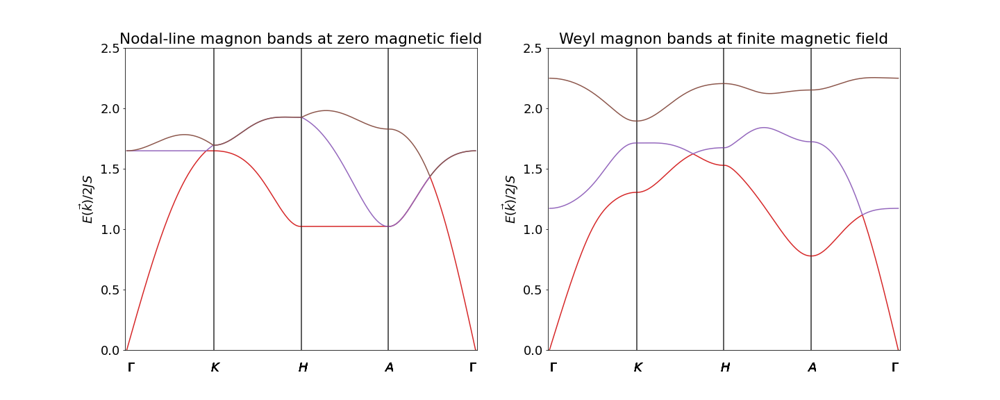
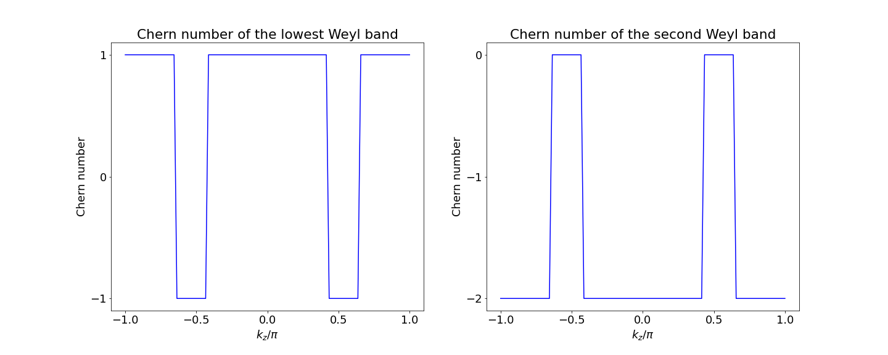
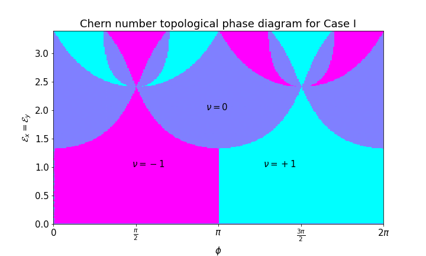
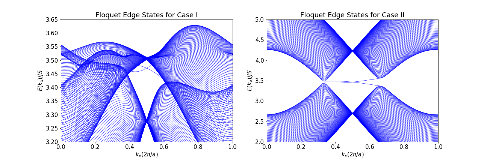

# Overview

During my academic career, I published over 50 scientific papers (see my [Google Scholar](https://scholar.google.ca/citations?user=ZcQiAIMAAAAJ&hl=en&oi=ao)) in leading peer-reviewed journals. This repository contains the python codes I developed for the two papers listed below:

1). S. A. Owerre, [Phys. Rev. B 97, 094412 (2018)](https://doi.org/10.1103/PhysRevB.97.094412)

2). S. A. Owerre, [Scientific Reports 9, 7197 (2019)](https://doi.org/10.1038/s41598-019-43702-9) 

## Weyl magnons in stacked kagome antiferromagnets

## Z2 Floquet topological magnon phase diagram

